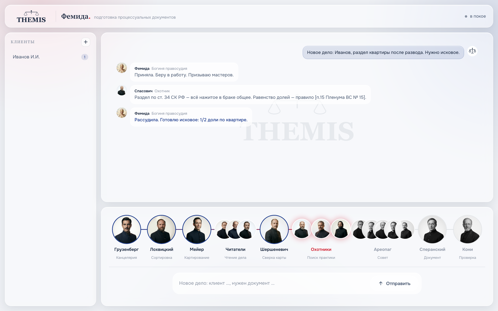

<div align="center">


# Themis (Фемида)

**Мультиагентная ИИ-система ведения российских судебных дел на Claude Code.**
13 агентов-юристов, рой охотников за практикой, Ареопаг из 5 правоведов,
локальное извлечение первички ($0), самообучение на правках, и cockpit —
интерфейс уровня Apple, где юристы «обсуждают» дело вживую.

*Multi-agent AI system for Russian litigation. 13 lawyer-agents, practice hunters,
a 5-jurist council, local-first OCR, self-learning, and an Apple-grade cockpit UI.*

</div>



---

## Что это

Themis ведёт судебные дела как живая юрфирма из ИИ-агентов под управлением
единого ассистента — **Фемиды, богини правосудия**. Она картирует дело, читает и
сверяет материалы, ищет и проверяет судебную практику (за позицию и против),
вырабатывает правовую позицию через совет, составляет процессуальные документы
готовыми к подаче и готовит юриста к заседанию. Главная ценность — не скорость
текста, а **встроенная многоуровневая верификация**: ни факт, ни позиция, ни
документ не идут дальше без подтверждения независимыми агентами.

## Ключевое

- **🏛 13 агентов-юристов** — канцелярия, картограф, читатели, сверка, три охотника
  за практикой, Ареопаг (совет 5 правоведов), составитель, ревизор, подготовка к суду.
- **🔒 Local-first извлечение ($0)** — Apple Vision OCR (русский точно, локально),
  markitdown (текст), whisper (аудио/видео). Смешанный PDF извлекается полностью.
  Авто-реквизиты (ИНН/№ дела/суммы) в сайдкар. **Никакого Ollama, никакого облака
  на основном проходе.**
- **🧠 Самообучение** — правишь готовый `.docx`, Фемида сравнивает «до/после»
  (содержание И форматирование) и больше не повторяет огрехи.
- **🖥 Cockpit** — локальный UI (FastAPI), где агенты переключаются вживую, чат
  ведётся последовательно, Фемида говорит женским голосом богини. Apple-эстетика.
- **🔗 Граф знаний** — `/graphify` вскрывает межкейсовые связи (общий оппонент,
  один объект, переиспользуемые аргументы) — экономия токенов на росте базы.
- **🔄 Самообновление** — `/themis-update` тянет последнюю логику с GitHub, **не
  трогая твои дела и базу знаний**.
- **🛡 Приватность** — данные клиентов (`cases/`) всегда локально, в публику не уходят.

## Архитектура агентов

```
Шаг 0  База знаний   →  practice_index.md (свериться перед внешним поиском)
Шаг 1  Картирование  →  Грузенберг (канцелярия) → Мейер (карта) + читатели
                        (Гольмстен/Буринский/Покровский) → Шершеневич (сверка)
Шаг 2  Практика      →  Спасович · Плевако · Карабчевский (охотники) → Ареопаг
Шаг 3  Позиция       →  Совет 5 правоведов (Урусов, Маклаков, Фойницкий…)
Шаг 4  Документ      →  Сперанский → .md + .docx (источник в каждом утверждении)
Шаг 5  Проверка      →  Кони (структура, реквизиты, форматирование)
Шаг 6  Самоконтроль  →  разбор ошибок → журнал уроков
```

Каждый шаг закрывается маркером консенсуса; без маркера система не идёт дальше.

## Установка

Требования: **macOS** (Apple Vision OCR), Python 3.11+, Xcode CLT (`xcode-select --install`),
[Claude Code](https://claude.com/claude-code).

```bash
git clone https://github.com/7teenno1-art/themis.git
cd themis
bash install.sh
```

`install.sh` ставит Python-зависимости, собирает Apple Vision OCR из исходника,
ставит whisper+ffmpeg, готовит директории и проверяет Claude Code CLI.

## Использование

**Через Claude Code:** открой проект, скажи
> «Новое дело: Иванов, раздел квартиры после развода. Нужно исковое».

Фемида прогонит протокол Шаг 0→5 и выдаст документ.

**Через Cockpit (UI):**
```bash
python3 cockpit/app.py    # → http://localhost:8800
```
Перетащи документы в окно или напиши задачу — увидишь, как юристы переключаются.

**Обновление:**
```bash
/themis-update            # тянет последнюю логику, данные не трогает
```

## Структура

```
.claude/agents/   13 агентов дела          cockpit/        UI (FastAPI + статика)
.claude/skills/   askacouncil, doc-drafter  scripts/        извлечение, генерация docx, OCR
.claude/commands/ слэш-команды              knowledge/      practice_index, redlines, уроки
.claude/CLAUDE.md протокол Фемиды           cases/          ДЕЛА — локально, не в git
AGENTS.md         зеркало для Codex          bin/            vision-ocr.swift (OCR-движок)
templates/        шаблоны документов         docs/           скриншоты, описание
```

## Приватность

`cases/` (материалы дел клиентов) — в `.gitignore`, **никогда не публикуются**.
Извлечение локальное ($0), документы остаются на твоём Mac. В репозитории — только
синтетический пример (`cases/ivanov-ivan`).

## Лицензия

MIT — см. [LICENSE](LICENSE). Построено на [Claude Code](https://claude.com/claude-code).
