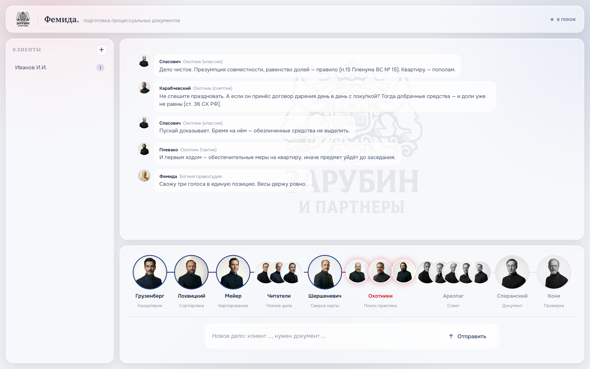
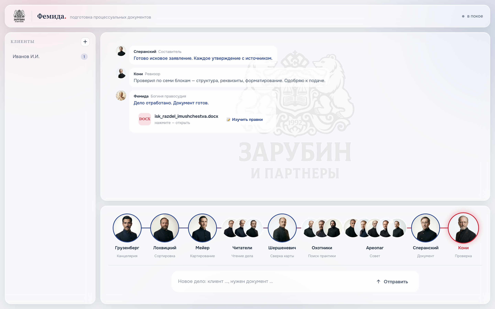

<div align="center">


# Themis · Фемида

**Multi-agent AI system for Russian litigation, built on Claude Code.**
**Мультиагентная ИИ-система ведения российских судебных дел на Claude Code.**

13 lawyer-agents · practice hunters · a 5-jurist council · local-first OCR ($0) ·
self-learning · an Apple-grade cockpit where the lawyers argue a case live.

13 агентов-юристов · охотники за практикой · Ареопаг из 5 правоведов ·
локальное извлечение ($0) · самообучение · cockpit, где юристы спорят о деле вживую.

**[English](#english) · [Русский](#русский)**

</div>


---

<a name="english"></a>
## English

### What it is

Themis runs litigation like a living law firm of AI agents led by a single
assistant — **Femida, the goddess of justice**. She maps the case, reads and
cross-checks the materials, hunts and verifies case law (both for and against the
position), forms a legal position through a council, drafts court-ready documents,
and prepares the lawyer for the hearing. The point isn't text speed — it's
**built-in multi-level verification**: no fact, position, or document passes on
without confirmation from independent agents and a consensus marker.

### How decisions are made — the lawyers argue

The practice hunters genuinely disagree. The classic builds the position, the
skeptic attacks it, the tactician adds procedure — then Femida weighs all three.
You see it happen live:



### The document lands in the chat, ready to open

When the work is done, the draft appears as a card you can open in Word — and feed
back for self-learning after you edit it.



### Highlights

- **13 lawyer-agents** — registry, cartographer, readers, reconciler, three
  practice hunters, a 5-jurist council (Areopagus), drafter, reviewer, hearing prep.
- **Local-first extraction ($0)** — Apple Vision OCR (accurate Russian, on-device),
  markitdown (text), whisper (audio/video). Mixed PDFs extracted in full.
  Auto-requisites (INN / case № / sums) to a sidecar. **No Ollama, no cloud on the
  main path.**
- **Self-learning** — you edit the finished `.docx`; Femida compares before/after
  (content *and* formatting) and stops repeating the same mistakes.
- **Cockpit** — a local UI (FastAPI) where agents switch live, the chat flows
  sequentially, and Femida speaks in the goddess's feminine voice.
- **Knowledge graph** — `/graphify` surfaces cross-case links (shared opponent,
  same object, reusable arguments) so the growing base saves tokens.
- **Self-update** — `/themis-update` pulls the latest logic from GitHub **without
  touching your cases or knowledge base**.
- **Privacy** — client data (`cases/`) stays local and never ships.

### The 13 agents

| Persona (RU) | Role (EN) | Step |
|---|---|---|
| Грузенберг / Gruzenberg | Registry — inbox intake | 1 |
| Лохвицкий / Lokhvitsky | Sorting | 1 |
| Мейер / Meyer | Case mapping | 1 |
| Гольмстен · Буринский · Покровский / Holmsten · Burinsky · Pokrovsky | Readers (scan / image / text) | 1 |
| Шершеневич / Shershenevich | Reconciler — verify readers | 1 |
| Спасович / Spasovich | Practice hunter — classic | 2 |
| Плевако / Plevako | Practice hunter — tactical | 2 |
| Карабчевский / Karabchevsky | Practice hunter — skeptic | 2 |
| Ареопаг / Areopagus (5 jurists) | Council — legal position | 3 |
| Сперанский / Speransky | Drafter | 4 |
| Кони / Koni | Reviewer | 5 |
| Андреевский / Andreevsky | Hearing prep | — |
| Рождественский / Rozhdestvensky | Archivist — knowledge base | — |

### Install

Requirements: **macOS** (Apple Vision OCR), Python 3.11+, Xcode CLT
(`xcode-select --install`), [Claude Code](https://claude.com/claude-code).

```bash
git clone https://github.com/zarubinphil/themis.git
cd themis
bash install.sh
```

`install.sh` installs Python deps, builds Apple Vision OCR from source, installs
whisper + ffmpeg, prepares directories and checks for the Claude Code CLI.

### Use

In Claude Code: open the project and say *"New case: Ivanov, split the flat after
divorce, draft a claim."* Femida runs steps 0→5 and produces the document.

Cockpit (UI): `python3 cockpit/app.py` → http://localhost:8800

Update: `/themis-update` — pulls the latest logic, leaves your data untouched.

### Privacy

`cases/` (client materials) is git-ignored and **never published**. Extraction is
local ($0); documents stay on your Mac. The repo ships only a synthetic example
(`cases/ivanov-ivan`).

### License

MIT — see [LICENSE](LICENSE). Built on [Claude Code](https://claude.com/claude-code).

---

<a name="русский"></a>
## Русский

### Что это

Themis ведёт судебные дела как живая юрфирма из ИИ-агентов под управлением единого
ассистента — **Фемиды, богини правосудия**. Она картирует дело, читает и сверяет
материалы, ищет и проверяет судебную практику (за позицию и против), вырабатывает
правовую позицию через совет, составляет процессуальные документы готовыми к подаче
и готовит юриста к заседанию. Главное — не скорость текста, а **встроенная
многоуровневая верификация**: ни факт, ни позиция, ни документ не идут дальше без
подтверждения независимыми агентами и маркера консенсуса.

### Как принимаются решения — юристы спорят

Охотники за практикой по-настоящему не соглашаются. Классик строит позицию, скептик
её ломает, тактик добавляет процессуальное — затем Фемида сводит три голоса. Это
видно вживую (скриншот выше: спор Спасович ↔ Карабчевский ↔ Плевако).

### Документ появляется в чате — открывай сразу

Когда работа сделана, черновик приходит карточкой: открыть в Word и, после твоих
правок, отдать на самообучение (скриншот выше).

### Ключевое

- **13 агентов-юристов** — канцелярия, картограф, читатели, сверка, три охотника за
  практикой, Ареопаг (совет 5 правоведов), составитель, ревизор, подготовка к суду.
- **Local-first извлечение ($0)** — Apple Vision OCR (русский точно, локально),
  markitdown (текст), whisper (аудио/видео). Смешанный PDF извлекается полностью.
  Авто-реквизиты (ИНН / № дела / суммы) в сайдкар. **Никакого Ollama, никакого
  облака на основном проходе.**
- **Самообучение** — правишь готовый `.docx`, Фемида сравнивает «до/после»
  (содержание И форматирование) и больше не повторяет огрехи.
- **Cockpit** — локальный UI (FastAPI), где агенты переключаются вживую, чат идёт
  последовательно, Фемида говорит женским голосом богини.
- **Граф знаний** — `/graphify` вскрывает межкейсовые связи (общий оппонент, один
  объект, переиспользуемые аргументы) — экономия токенов на росте базы.
- **Самообновление** — `/themis-update` тянет последнюю логику с GitHub, **не трогая
  твои дела и базу знаний**.
- **Приватность** — данные клиентов (`cases/`) всегда локально, в публику не уходят.

### 13 агентов

| Персонаж | Роль | Шаг |
|---|---|---|
| Грузенберг | Канцелярия — приём входящих | 1 |
| Лохвицкий | Сортировка | 1 |
| Мейер | Картирование дела | 1 |
| Гольмстен · Буринский · Покровский | Читатели (скан / картинка / текст) | 1 |
| Шершеневич | Сверка читателей | 1 |
| Спасович | Охотник — классик | 2 |
| Плевако | Охотник — тактик | 2 |
| Карабчевский | Охотник — скептик | 2 |
| Ареопаг (5 правоведов) | Совет — правовая позиция | 3 |
| Сперанский | Составитель | 4 |
| Кони | Ревизор | 5 |
| Андреевский | Подготовка к заседанию | — |
| Рождественский | Архивист — база знаний | — |

### Установка

Требования: **macOS** (Apple Vision OCR), Python 3.11+, Xcode CLT
(`xcode-select --install`), [Claude Code](https://claude.com/claude-code).

```bash
git clone https://github.com/zarubinphil/themis.git
cd themis
bash install.sh
```

`install.sh` ставит Python-зависимости, собирает Apple Vision OCR из исходника,
ставит whisper + ffmpeg, готовит директории и проверяет Claude Code CLI.

### Использование

В Claude Code: открой проект, скажи *«Новое дело: Иванов, раздел квартиры после
развода, нужно исковое»*. Фемида прогонит Шаг 0→5 и выдаст документ.

Cockpit (UI): `python3 cockpit/app.py` → http://localhost:8800

Обновление: `/themis-update` — тянет последнюю логику, данные не трогает.

### Приватность

`cases/` (материалы дел) — в `.gitignore`, **никогда не публикуется**. Извлечение
локальное ($0), документы остаются на твоём Mac. В репозитории — только
синтетический пример (`cases/ivanov-ivan`).

### Лицензия

MIT — см. [LICENSE](LICENSE). Построено на [Claude Code](https://claude.com/claude-code).
