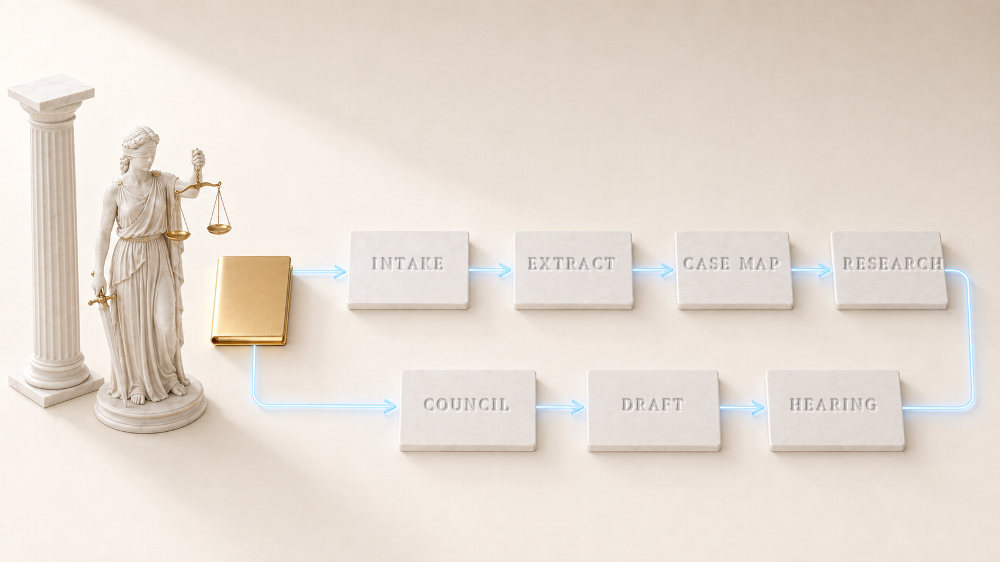
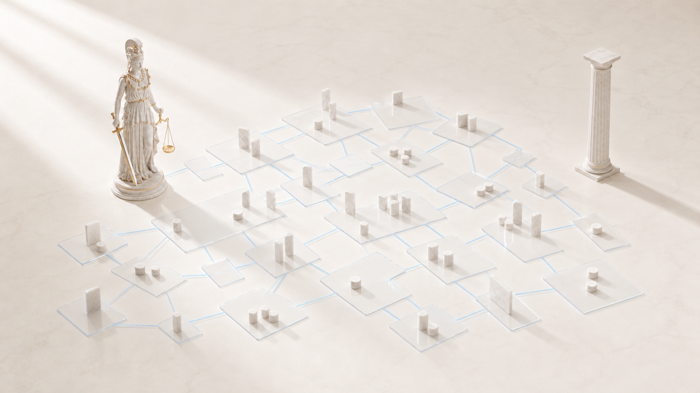
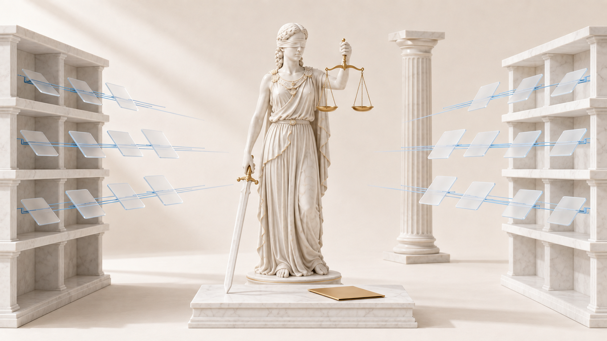
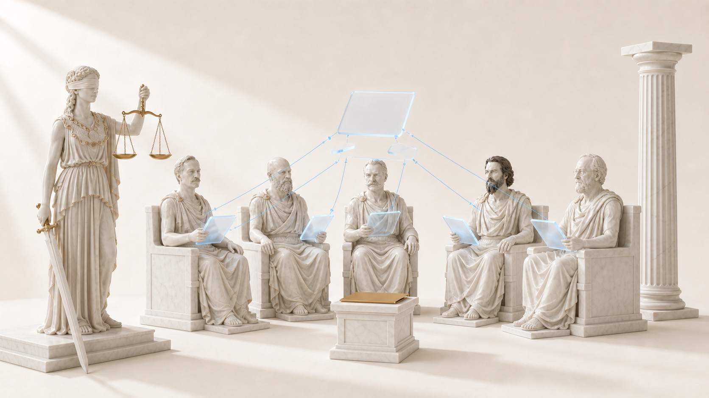

# Themiz

Themiz takes the mechanics of a court case off your desk: it reads the file, hunts case law, and reviews its own documents.

[Русский](README.ru.md) · [中文](README.zh.md)

[](LICENSE) [](https://github.com/zarubinvibe/themiz/stargazers) [](https://github.com/zarubinvibe/themiz) [](https://github.com/zarubinvibe/athena#olympuz-family)

<p align="center"></p>

<!-- owner-welcome:start -->

> Hello. I am Fil.
>
> I built Themiz for myself: I was tired of losing evenings to the mechanical part of a case — two hundred pages of scans, dates to reconcile, citations to check. If it turns out to be useful to you too, I am glad.
>
> Please try it. If something breaks, open an issue — I read them. If you like it, star the repository and tell a colleague who still does all of this by hand. And take a look at the other Olympuz projects: https://zarubinvibe.com
>
> — Filipp Zarubin

<!-- owner-welcome:end -->

## Contents

- [What This Is](#what-this-is)
- [Why It Helps](#why-it-helps)
- [The Main Advantage](#the-main-advantage)
- [How It Works](#how-it-works)
- [Quickstart](#quickstart)
- [Simple Comparison](#simple-comparison)
- [Simple Words](#simple-words)
- [Safety And Privacy](#safety-and-privacy)
- [Limits](#limits)
- [Star And Contribute](#star-and-contribute)

<!-- beginner-readme:start -->

## What This Is

The project was renamed: Themis is now Themiz, spelled like the rest of the Olympuz family. Old GitHub links still redirect here, but an existing clone or fork needs `git remote set-url` to follow.

Themiz works next to a lawyer. It reads the file on your computer, builds a case map, hunts practice for you and against you, drafts a document and hands it to a different agent for review. The decisions stay with you, and that is the design, not a disclaimer at the end.

## Why It Helps

A good lawyer's time does not go into law. Two hundred pages of scans. Reconciling dates. Checking citations. That one detail that was definitely somewhere in volume three. Themiz takes that part whole and leaves you the part where thinking happens.

## The Main Advantage

**Main advantage:** the numbers and the text of the law come from a program, not from a model.

**Why this is better:** Statutory interest, procedural deadlines, court fees and amounts in words are computed in code. Statutes are quoted from the corpus on your own disk, so a paraphrase cannot quietly replace the article.

## How It Works

A case moves through stages. Each has its own agents, and no document leaves without a second pair of eyes.

<!-- workflow-diagram:start -->

<p align="center"></p>

<!-- workflow-diagram:end -->

| Stage | What happens |
|---|---|
| 1. Intake | Scans, photos, and documents land in the case folder |
| 2. Extract | Apple Vision recognition, direct text, checksum-verified details |
| 3. Case map | Parties, dates, claims, and evidence in one picture |
| 4. Research | Support, procedural moves, and the opponent's best argument |
| 5. Council | A position assembled from an argument, not from one opinion |
| 6. Draft | A separate reviewer, format checks, and a personal-data guard |
| 7. Hearing | Deadlines, a local dashboard, optional Telegram reminders |

### Step 1: Hand over the case files

You drop the file into the case folder. Client folders are closed from publication at the repository level, so material stays local.

<p align="center"></p>

**You get:** one folder per case, with everything the work will need.

### Step 2: Scans are read on your Mac

Recognition runs locally, about a second and a half per page. Registration numbers, case numbers, and amounts are pulled out and checked by their control digit without going online.

<p align="center"></p>

**You get:** readable text with the key details already verified.

### Step 3: The case map is built

Facts move from the documents into a single map: who, when, what is claimed, and what proves it. A separate agent cross-checks the readers against each other.

<p align="center"></p>

**You get:** one place to look instead of rereading the whole file.

### Step 4: Case law for and against

One agent looks for practice that supports your position, another for procedural moves, and a third deliberately hunts practice against you. The search request is depersonalised.

<p align="center"></p>

**You get:** both sides of the argument before the other side makes it.

### Step 5: Five jurists argue it out

Five reviewer agents take the position apart from different angles and put it back together. Disagreement is the point: a weak argument is meant to fall here, not in court.

<p align="center"></p>

**You get:** a position with its weak points already named.

### Step 6: One writes, another checks

The document is written by one agent and reviewed by another that did not write it. Assembly before review is refused, the format is checked before filing, and a guard runs over personal data on every commit.

<p align="center"></p>

**You get:** a draft you edit as a lawyer, not a text you have to re-verify line by line.

### Step 7: Hearing prep and reminders

Deadlines are calculated with the working calendar and a reference to the rule. A local dashboard shows the state of the work. Reminders go to your own bot, carrying dates only.

<p align="center"></p>

**You get:** the hearing prepared, and edits you make teach the next document.

## Quickstart

You need a Mac for scan recognition, Python 3.11 or newer, Xcode Command Line Tools, and Claude Code.

```bash
git clone https://github.com/zarubinvibe/themiz.git
cd themiz
bash install.sh

# дальше открывайте, чем привычнее:
claude                  # Claude Code
codex                   # Codex CLI
code .                  # VS Code: агент открывается внутри редактора
python3 cockpit/app.py   # только панель в браузере, без агента
```

The three lines above are the whole install. `bash install.sh` sets everything up and asks before it installs anything. It needs no agent at all: a plain terminal is enough.

**Claude Code.** Run `claude` in the folder and say `/themiz-setup`. The setup goes as a conversation, one question at a time.

**Codex CLI.** Run `codex` in the same folder. The same agents and the same rules are already inside the project.

**VS Code or Cursor.** Open the folder with `code .` and start your agent inside the editor.

**No agent at all.** `python3 cockpit/app.py` opens the local dashboard at `http://127.0.0.1:8800`, where you can read a case, follow deadlines and collect a document by hand.

No Git? Take [the ZIP](https://github.com/zarubinvibe/themiz/archive/refs/heads/main.zip) and unpack it. The install is the same.

Never done this before? [The onboarding](docs/ONBOARDING.md) walks the whole first run step by step and says what you see after every command.

**You get:** the setup asks about your practice one question at a time, downloads the codes you need first, and ends by testing itself on a real document of yours.

## Simple Comparison

| Option | What it is | Where the case file lives | Reads your scans | Practice for and against | Drafts the document | Who checks the result | Price |
|---|---|---|---|---|---|---|---|
| **Themiz** | Multi-agent assistant for one case | On your Mac | Yes, locally | Yes, both sides | Yes, to the case contract | A second agent, a separate role | Free for an individual lawyer |
| Doing it by hand | A lawyer and a folder | With you | You read them yourself | As much as the week allows | Yes | You do | Your hours |
| ConsultantPlus, Garant | Russian legal reference systems | Not for case material | No | Search across statutes and practice | Templates | You do | Subscription |
| Sudact, the court card index | Open search of court acts | Not for case material | No | Search of acts | No | You do | Free |
| ChatGPT, Claude as they come | A general chat assistant | In the vendor's cloud | If you attach the file | From the model's memory | Yes | You do | Subscription |
| Harvey, CoCounsel | Legal AI for firms | In the vendor's cloud | Yes | Yes, for their own jurisdictions | Yes | Depends on the plan | Enterprise contract |
| Doczilla, FreshDoc | Document assembly | In the vendor's cloud | No | No | Yes, from a template | You do | Subscription |

Names belong to their owners. The table describes what each option is built for, not a benchmark: other products change, and this page does not promise on their behalf.

## Simple Words

| Word | Simple meaning |
|---|---|
| Repository | The project folder that Git stores and versions |
| Terminal | The window where you type commands |
| Command | One instruction you give the computer |
| Branch | A separate line of changes that does not touch `main` |
| Pull Request | A request to review your change and accept it |
| Case map | One file that holds parties, dates, claims, and evidence |
| Agent | One assistant with a narrow job, such as reading scans or hunting case law |

## Safety And Privacy

- Reading and recognition run on your computer; client folders are closed from publication at the repository level.
- Case law search sends a depersonalised request, never the case file.
- A cloud check of a single page is allowed only when local recognition returns nothing or a critical detail must be confirmed. There is no silent switch to the cloud.
- Telegram reminders use your own bot and carry dates and the word "done": no names, case numbers, or amounts.
- A personal-data guard runs on every commit, and a separate guard refuses to erase case material.
- Document format is checked before filing, and assembly before review is refused.

Before putting client material on a shared computer, read [SECURITY.md](SECURITY.md).

## Limits

Status: in development, built to work under a lawyer's control. The main path runs through Claude Code.

- Local scan recognition depends on Apple Vision and works on macOS only. Text PDF, DOCX, and XLSX are read on other systems too.
- Case law search depends on an external source and is sometimes unavailable.
- A red gate or a missing agent stops the workflow instead of guessing.
- Themiz does not represent you, does not sign anything, and does not replace a lawyer's judgement.
- A clean install on Windows and Linux has not been verified yet.

Deeper: [how it really works](docs/HOW-IT-WORKS.ru.md), in Russian and without advertising, and [the full reference](docs/DETAILS.md) with the agent roster.

## Star And Contribute

Useful? Give Themiz a star: [https://github.com/zarubinvibe/themiz](https://github.com/zarubinvibe/themiz). It takes a second and it decides whether other people ever find the project.

Want to change something? The path is short: fork the repository, create a branch, commit your change, push the branch, then open a Pull Request. Do not push directly to `main`; the release gate rejects it.

Found a problem instead? Open an issue at [https://github.com/zarubinvibe/themiz/issues](https://github.com/zarubinvibe/themiz/issues) and say what you ran and what happened.

<!-- beginner-readme:end -->

<!-- pantheon-family:start -->
## Olympuz family

This is one of the public [Olympuz projects](https://github.com/zarubinvibe/athena#olympuz-family). Each row opens the repository or downloads its source as a ZIP.

| Type | Name | What it does | Source |
|---|---|---|---|
| project | Athena | Portable agent OS that restores a complete Claude and Codex setup on a new Mac. | [Repository](https://github.com/zarubinvibe/athena) · [ZIP](https://github.com/zarubinvibe/athena/archive/refs/heads/main.zip) |
| project | Helioz | 24/7 agent work conveyor with verified completion markers and goal-based overnight decisions. | [Repository](https://github.com/zarubinvibe/helioz) · [ZIP](https://github.com/zarubinvibe/helioz/archive/refs/heads/main.zip) |
| project | Mnemazine | Local-first memory system that turns raw inputs into verified reusable knowledge. | [Repository](https://github.com/zarubinvibe/mnemazine) · [ZIP](https://github.com/zarubinvibe/mnemazine/archive/refs/heads/main.zip) |
| project | Themiz | Multi-agent assistant for Russian litigation with local OCR and review by a five-jurist council. | [Repository](https://github.com/zarubinvibe/themiz) · [ZIP](https://github.com/zarubinvibe/themiz/archive/refs/heads/main.zip) |
| project | Zeuz | Factory that turns an idea into a governed multi-agent workflow with gates, observability, and replay. | [Repository](https://github.com/zarubinvibe/zeuz) · [ZIP](https://github.com/zarubinvibe/zeuz/archive/refs/heads/main.zip) |
| project | Lynceuz | Collects public web evidence at zero cost and stops with an honest reason when the safe routes end. | [Repository](https://github.com/zarubinvibe/lynceuz) · [ZIP](https://github.com/zarubinvibe/lynceuz/archive/refs/heads/main.zip) |
<!-- pantheon-family:end -->

## License

Themiz Community Licence 1.0: free for an individual lawyer, including private practice. Organisations need a commercial licence. See [LICENSE](LICENSE) and [LICENSE.ru.md](LICENSE.ru.md).
