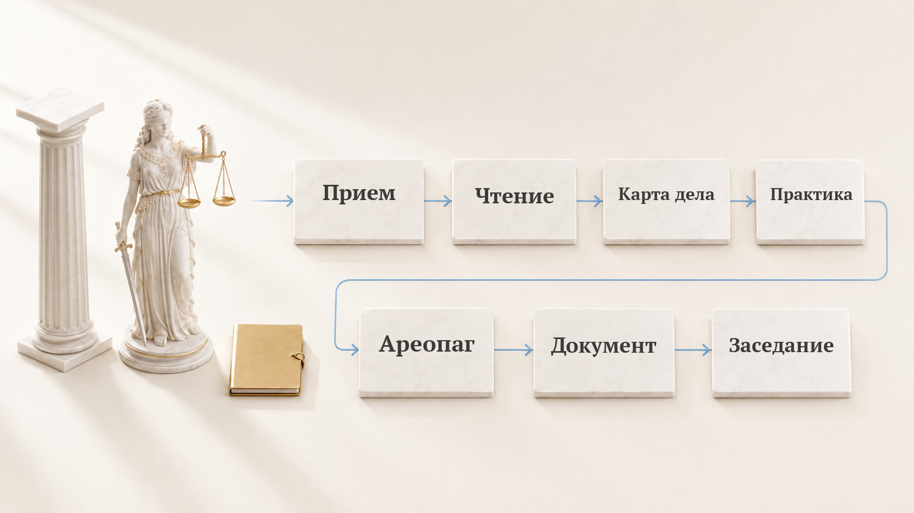

# Фемида

Фемида берет на себя механику судебного дела: читает материалы, ищет практику и проверяет собственные документы.

[English](README.md) · [中文](README.zh.md)

[](LICENSE) [](https://github.com/zarubinvibe/themiz/stargazers) [](https://github.com/zarubinvibe/themiz) [](https://github.com/zarubinvibe/athena#olympuz-family)

<p align="center"></p>

<!-- owner-welcome:start -->

> Привет. Я практикующий юрист, и слишком много моего времени уходило на механику: двести страниц сканов, сверка дат, проверка ссылок, одна деталь, зарытая где-то в материалах.
>
> Фемида забирает эту работу и оставляет мне ту часть, где нужно суждение. Она ничего не решает, и не должна.
>
> — Филипп Зарубин

<!-- owner-welcome:end -->

## Оглавление

- [Что это](#что-это)
- [Зачем это нужно](#зачем-это-нужно)
- [Главное преимущество](#главное-преимущество)
- [Как это работает](#как-это-работает)
- [Быстрый старт](#быстрый-старт)
- [Простое сравнение](#простое-сравнение)
- [Простые слова](#простые-слова)
- [Безопасность и приватность](#безопасность-и-приватность)
- [Ограничения](#ограничения)
- [Звезда и вклад](#звезда-и-вклад)

<!-- beginner-readme:start -->

## Что это

Проект переименован: Themis теперь Themiz — как и остальные имена семейства Олимпуса. Прежние ссылки на GitHub переадресуются сюда, но клону или форку нужен `git remote set-url`, чтобы поехать следом.

Фемида работает рядом с юристом. Она читает материалы у вас на компьютере, собирает карту дела, ищет практику за вас и против вас, готовит документ и отдает его на проверку другому агенту. Решения остаются за вами, и это не оговорка в конце, а устройство.

## Зачем это нужно

У хорошего юриста время уходит не на право. Двести страниц сканов. Сверка дат. Проверка ссылок. Та самая деталь, которая точно была где-то в третьем томе. Эту часть Фемида забирает целиком, а вам оставляет ту, где нужно думать.

## Главное преимущество

**Главное преимущество:** цифры и текст закона выдает программа, а не модель.

**Почему это лучше:** Проценты по 395-й, процессуальные сроки, госпошлина и сумма прописью считаются кодом. Нормы цитируются из корпуса на вашем диске, поэтому пересказ не подменит текст статьи незаметно.

## Как это работает

Дело идет по стадиям. У каждой свои агенты, и ни один документ не выходит без вторых глаз.

<!-- workflow-diagram:start -->

<p align="center"></p>

<!-- workflow-diagram:end -->

| Этап | Что происходит |
|---|---|
| 1. Прием | Сканы, фотографии и документы ложатся в папку дела |
| 2. Чтение | Распознавание Apple Vision, прямой текст, реквизиты с контрольной суммой |
| 3. Карта дела | Стороны, даты, требования и доказательства в одной картине |
| 4. Практика | Поддержка, процессуальные ходы и лучший довод оппонента |
| 5. Ареопаг | Позиция, собранная из спора, а не из одного мнения |
| 6. Документ | Отдельный проверяющий, проверка формата и сторож персональных данных |
| 7. Заседание | Сроки, локальная панель, необязательные напоминания в Telegram |

### Шаг 1: Передайте материалы дела

Вы кладете материалы в папку дела. Папки доверителей закрыты от публикации на уровне репозитория, поэтому материал остается локальным.

<p align="center"></p>

**Что получится:** одна папка на дело, где лежит все, что понадобится в работе.

### Шаг 2: Сканы читаются на вашем Mac

Распознавание идет локально, примерно полторы секунды на страницу. ИНН, ОГРН, номера дел и суммы вынимаются и проверяются контрольной суммой без выхода в интернет.

<p align="center"></p>

**Что получится:** читаемый текст, где ключевые реквизиты уже проверены.

### Шаг 3: Строится карта дела

Факты переезжают из документов в единую карту: кто, когда, что требует и чем это подтверждается. Отдельный агент сверяет читателей между собой.

<p align="center"></p>

**Что получится:** одно место, куда смотреть, вместо перечитывания всего дела.

### Шаг 4: Практика за вас и против вас

Один агент ищет практику за вашу позицию, другой процессуальные ходы, третий намеренно ищет практику против вас. Поисковый запрос уходит обезличенным.

<p align="center"></p>

**Что получится:** обе стороны спора до того, как их приведет оппонент.

### Шаг 5: Пятеро правоведов спорят

Пятеро проверяющих агентов разбирают позицию с разных сторон и собирают заново. Несогласие здесь и есть смысл: слабый довод должен упасть тут, а не в заседании.

<p align="center"></p>

**Что получится:** позиция, у которой слабые места уже названы.

### Шаг 6: Один пишет, другой проверяет

Документ пишет один агент, а проверяет другой, который его не писал. Собрать документ раньше проверки нельзя, формат сверяется перед подачей, а сторож персональных данных проходит по каждому коммиту.

<p align="center"></p>

**Что получится:** проект, который вы правите как юрист, а не текст, который надо перепроверять построчно.

### Шаг 7: Подготовка к заседанию и напоминания

Сроки считаются по производственному календарю со ссылкой на норму. Локальная панель показывает состояние работы. Напоминания уходят вашему собственному боту и несут только даты.

<p align="center"></p>

**Что получится:** заседание подготовлено, а ваши правки учат следующий документ.

## Быстрый старт

Нужен Mac для распознавания сканов, Python 3.11 или новее, Xcode Command Line Tools и Claude Code.

```bash
git clone https://github.com/zarubinvibe/themiz.git
cd themiz
claude
# inside Claude Code run: /themiz-setup
```

Хотите обычный установщик? Запустите `bash install.sh` в той же папке: он ставит зависимости после одного подтверждения, но не проводит интервью о вашей практике. Нет Git? Возьмите [ZIP](https://github.com/zarubinvibe/themiz/archive/refs/heads/main.zip). Локальная панель запускается командой `python3 cockpit/app.py` на порту 8800. Первый раз? Откройте проект в Claude Code и запустите `/themiz-setup`: установка пройдет разговором, по одному вопросу, и ничего не поставится без вашего «да».

Делаете это впервые? [Онбординг](docs/ONBOARDING.ru.md) проводит весь первый запуск по шагам и говорит, что видно после каждой команды.

**Что получится:** установка спрашивает о вашей практике по одному вопросу, первыми качает нужные вам кодексы и в конце проверяет себя на вашем настоящем документе.

## Простое сравнение

| Вариант | Когда подходит | Что получаете | Минус |
|---|---|---|---|
| **Фемида** | Настоящее дело со сканами, сроками и документами | Локальное чтение, карта дела, обе стороны практики, проверенные проекты | Нужен Mac для распознавания, а решает по-прежнему юрист |
| Делать руками | Небольшое дело | Полный контроль | Часы механики на каждое дело |
| Обычный чат-помощник | Быстрый вопрос по праву | Мгновенные ответы | Цитаты по памяти, без материалов дела и без расчета сроков |
| Коммерческая legal-платформа | Фирма с бюджетом | Поддержка и интеграции | Материалы дела уходят с вашей машины, и платить надо за каждого человека |

## Простые слова

| Слово | Простое значение |
|---|---|
| Repository | Папка проекта, которую хранит и версионирует Git |
| Terminal | Окно, куда вы вводите команды |
| Command | Одна инструкция компьютеру |
| Branch | Отдельная линия изменений, которая не трогает `main` |
| Pull Request | Просьба проверить ваше изменение и принять его |
| Case map | Один файл, где собраны стороны, даты, требования и доказательства |
| Agent | Один помощник с узкой задачей: читать сканы или искать практику |

## Безопасность и приватность

- Чтение и распознавание идут на вашем компьютере, папки доверителей закрыты от публикации на уровне репозитория.
- Поиск практики отправляет обезличенный запрос, а не материалы дела.
- Облачная проверка одной страницы допустима, только если локальное распознавание вернуло пустоту или нужно подтвердить критичный реквизит. Молчаливого переключения в облако нет.
- Напоминания в Telegram идут через вашего бота и несут даты и слово «готово»: без фамилий, номеров дел и сумм.
- Сторож персональных данных проходит по каждому коммиту, а отдельный сторож не дает стереть материалы дела.
- Формат документа проверяется перед подачей, а собрать документ раньше проверки нельзя.

Прежде чем класть материалы доверителя на общий компьютер, прочитайте [SECURITY.md](SECURITY.md).

## Ограничения

Статус: в разработке, рассчитана на работу под контролем юриста. Основной путь идет через Claude Code.

- Локальное распознавание сканов зависит от Apple Vision и работает только на macOS. Текстовые PDF, DOCX и XLSX читаются и на других системах.
- Поиск практики зависит от внешнего источника и иногда недоступен.
- Красный гейт или отсутствующий агент останавливает workflow, а не додумывает за вас.
- Фемида не представляет ваши интересы, ничего не подписывает и не заменяет суждение юриста.
- Чистая установка на Windows и Linux пока не проверена.

Глубже: [как я работаю на самом деле](docs/HOW-IT-WORKS.ru.md) без рекламы и [полный разбор](docs/DETAILS.ru.md) с составом агентов.

## Звезда и вклад

Пригодилось? Поставьте Фемида звезду: [https://github.com/zarubinvibe/themiz](https://github.com/zarubinvibe/themiz). Это секунда, а от нее зависит, найдут ли проект другие люди.

Хотите что-то поправить? Путь короткий: сделайте fork, заведите ветку, оформите commit, отправьте push и откройте Pull Request. Не отправляйте push прямо в `main`: релизный gate его отклонит.

Нашли ошибку? Заведите issue на [https://github.com/zarubinvibe/themiz/issues](https://github.com/zarubinvibe/themiz/issues) и напишите, что запускали и что получилось.

<!-- beginner-readme:end -->

<!-- pantheon-family:start -->
## Семья Olympuz

Это один из публичных [проектов семьи Olympuz](https://github.com/zarubinvibe/athena#olympuz-family). Из таблицы можно открыть репозиторий или сразу скачать исходники в ZIP.

| Тип | Название | Что внутри | Скачать |
|---|---|---|---|
| проект | Athena | Переносимая агентная ОС: разворачивает рабочую среду Claude и Codex на новом Mac. | [Репозиторий](https://github.com/zarubinvibe/athena) · [ZIP](https://github.com/zarubinvibe/athena/archive/refs/heads/main.zip) |
| проект | Helioz | Конвейер работы агентов 24/7 с проверяемыми отметками готовности и ночными решениями по цели владельца. | [Репозиторий](https://github.com/zarubinvibe/helioz) · [ZIP](https://github.com/zarubinvibe/helioz/archive/refs/heads/main.zip) |
| проект | Mnemazine | Локальная система памяти: превращает сырье в проверенные знания для повторного использования. | [Репозиторий](https://github.com/zarubinvibe/mnemazine) · [ZIP](https://github.com/zarubinvibe/mnemazine/archive/refs/heads/main.zip) |
| проект | Themiz | Многоагентный помощник по российским судебным делам с локальным OCR и советом из пяти юристов. | [Репозиторий](https://github.com/zarubinvibe/themiz) · [ZIP](https://github.com/zarubinvibe/themiz/archive/refs/heads/main.zip) |
| проект | Zeuz | Фабрика многоагентных workflow: собирает систему с правилами, гейтами, наблюдаемостью и replay. | [Репозиторий](https://github.com/zarubinvibe/zeuz) · [ZIP](https://github.com/zarubinvibe/zeuz/archive/refs/heads/main.zip) |
| проект | Lynceuz | Собирает доказательства из открытого веба за ноль рублей и честно останавливается, когда безопасные пути кончились. | [Репозиторий](https://github.com/zarubinvibe/lynceuz) · [ZIP](https://github.com/zarubinvibe/lynceuz/archive/refs/heads/main.zip) |
<!-- pantheon-family:end -->

## Лицензия

Themiz Community Licence 1.0: частному юристу бесплатно, включая личную практику. Организации нужна коммерческая лицензия. Тексты в [LICENSE.ru.md](LICENSE.ru.md) и [LICENSE](LICENSE).
