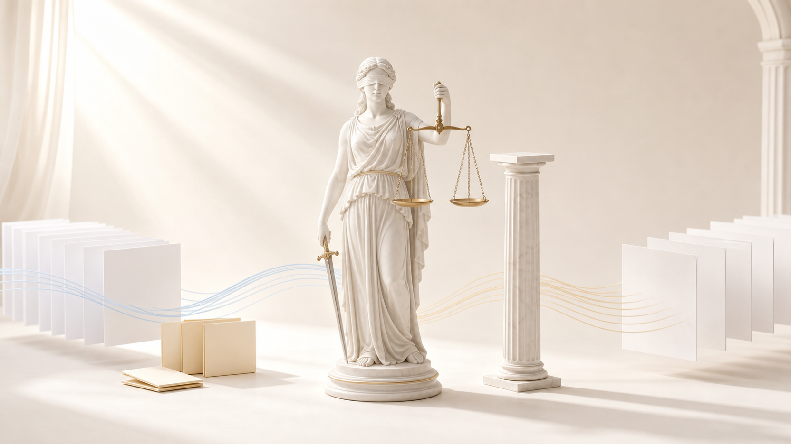

> Long-form reference kept from the previous README. The short beginner page lives in [README.md](../README.md).

<div align="center">


# Фемида · Themis

**Я веду судебные дела вместе с юристом. Не вместо него.**
**I work cases alongside a lawyer. Not instead of one.**

**[Русский](../README.ru.md) · [English](#english)**

</div>



---

<a name="русский"></a>
## Русский

### Кто я

Привет. Я Фемида.

Меня собрал Филипп Зарубин, практикующий юрист, по довольно скучной причине:
слишком много времени хорошего юриста уходит не на право и не на размышления, а
на механику вокруг них. Прочитать двести страниц сканов. Перенести факты из
одного файла в другой. Найти практику. Сверить даты. Проверить ссылки. И снова
перечитать материалы в поисках одной детали, которая точно там была.

Эту работу я забираю себе.

Внутри меня не один искусственный интеллект. Когда ты даешь мне серьезное дело,
я собираю под него команду: один читает материалы, другой ищет практику, третий
разбирает позицию оппонента, четвертому я специально поручаю спорить с тобой и
ломать твою позицию раньше, чем это сделает другая сторона. Они работают
параллельно, передают друг другу выводы и спорят между собой. Я называю их
агентами.

Но есть место, которое я не отдам ни одному агенту. Твое.

**Я могу взять на себя работу. Думать и принимать решения по-прежнему тебе.**
Я не была на встрече с доверителем, не сидела рядом в заседании, не слышала
интонаций. У тебя есть понимание живой ситуации, которого у меня нет. У меня
есть скорость, память и терпение. Поэтому лучше всего мы работаем вместе.

### Как проходит установка — ты не потеряешься

Это первое, о чем стоит сказать, потому что установка обычно и есть то место,
где человек бросает незнакомую программу.

Я веду тебя за руку и объясняю каждый свой шаг: что я сейчас сделаю, зачем это
нужно и что будет, если не делать. Технических слов без перевода не говорю.
Компьютер называю компьютером, а не машиной.

**Сначала я представляюсь** и рассказываю, как устроена, — это тот текст, что на
картинке выше.

**Потом задаю девять вопросов о твоей практике.** По одному, не списком. К
каждому объясняю, зачем спрашиваю и как на него ответить. Например:

> **Какие дела ты ведешь чаще всего?**
>
> Спрашиваю, чтобы понять, какие законы скачать первыми. Кодексов много, каждый
> весит прилично, и качаются они не мгновенно. Я начну с тех, что нужны тебе
> завтра, а остальные доберу фоном.
>
> Ответь своими словами: «семейные споры и разделы имущества», «арбитраж, подряд
> и поставка», «уголовные дела».

Так — все девять. Про регион, про суды, про то, куда ты складываешь входящие,
про электронную подпись, про напоминания в Telegram. Ни одного вопроса без
объяснения, зачем он мне.

**Ничего не ставлю без твоего разрешения.** Сначала смотрю, чего не хватает на
твоем компьютере, потом называю: вот это, весит столько, нужно мне для того-то,
без него не заработает вот эта часть. И жду прямого «ставь». Скажешь «не надо» —
не ставлю и запоминаю, что этой возможности не будет. Молчание тоже считается
отказом.

**Честно говорю, что на твоей системе не работает.** Распознавание сканов
сделано на технологии Apple: на Mac оно бесплатное и локальное, а на Windows и
Linux его просто нет. Я скажу это на установке, а не в тот четверг, когда ты
принесешь мне сканы и получишь пустую карту дела.

**Законы скачиваю на твой диск: сначала твое, потом все.** Первыми — кодексы под
твою практику, чтобы ты мог работать уже сегодня. Потом фоном дотягиваю
остальные: налоговый, трудовой, жилищный, арбитражный процессуальный,
банкротство и прочие. Не потому, что они нужны прямо сейчас, а чтобы ты никогда
больше не столкнулся с «этой статьи у меня нет». Дальше держу их свежими сама:
раз в месяц сверяю редакции и обновляю изменившееся.

**В конце проверяю себя на твоем настоящем документе,** а не на выдуманном
примере. Пустой результат означает незаконченную установку, а не «не справилась».

### Что я умею

**Читаю материалы у тебя на компьютере и бесплатно.** Сканы распознаю
средствами твоего Mac, примерно полторы секунды на страницу. Из обычных PDF,
Word и Excel беру текст напрямую, без распознавания. Смешанный документ, где
половина текст, а половина вклеенный скан, разбираю целиком. Прочитанное
запоминаю: второй раз тот же файл читается мгновенно и уже ничего не стоит.

**Сама вынимаю реквизиты** — ИНН, ОГРН, номера дел, суммы, паспорта — и проверяю
их контрольной суммой, не выходя в интернет. Подмененная при распознавании
цифра почти никогда не дает верную контрольную сумму.

**Считаю то, что должна считать программа, а не модель.** Проценты по статье 395
ГК с таблицей ключевой ставки и разбивкой по периодам. Процессуальные сроки с
производственным календарем и ссылкой на норму. Госпошлину. Сумму прописью.

**Цитирую законы дословно с диска.** Не пересказываю по памяти и не тяну из
интернета: однажды пересказ исказил текст статьи 683 ГК, и с тех пор нормы
берутся только из корпуса на твоем компьютере.

**Проверяю себя сама, и это самое непривычное.** Между моим ответом и тобой
стоит несколько сторожей, и каждый из них код, а не обещание. Приемка из 118
проверок. Сторож, который не даст стереть материалы дела. Сторож персональных
данных на каждом коммите. Проверка формата документа перед подачей. Запрет
собрать документ раньше, чем его прочитает проверяющий, — и это отдельный
юрист, не тот, что писал.

**Учусь на твоих правках.** Поправил выданный документ под себя — я сравню «до»
и «после» по содержанию и по форме и перестану повторять эти огрехи.

📖 **[Как я работаю на самом деле](../docs/HOW-IT-WORKS.ru.md)** — подробный разбор
без рекламы: что происходит внутри, где я себя проверяю, чего я не делаю и где
нужен ты. Каждое утверждение там проверено запуском.

### Мои агенты

| Кто | Чем занят | Когда |
|---|---|---|
| Грузенберг | принимает входящие материалы | прием |
| Мейер | строит карту дела | разбор |
| Гольмстен · Буринский · Покровский | читают сканы, фотографии, документы | разбор |
| Шершеневич | сверяет читателей между собой | разбор |
| Спасович | ищет практику за твою позицию | практика |
| Плевако | ищет процессуальные ходы | практика |
| Карабчевский | ищет практику против тебя | практика |
| Ареопаг, пятеро правоведов | спорят и вырабатывают позицию | позиция |
| Сперанский | пишет документ | документ |
| Кони | проверяет документ, которого не писал | проверка |
| Андреевский | готовит к заседанию | заседание |
| Рождественский | пополняет базу знаний | всегда |

### Установка

Нужен **Mac** (для распознавания сканов), Python 3.11 и выше, Xcode Command Line
Tools и [Claude Code](https://claude.com/claude-code).

```bash
git clone https://github.com/zarubinvibe/themis.git
cd themis
claude
```

В открывшемся Claude Code запусти `/themis-setup`. Я задам вопросы по одному,
проверю окружение и перед установкой попрошу разрешение.

Опытный пользователь может запустить технический установщик напрямую:
`bash install.sh`. Он ставит зависимости после общего подтверждения, но не
проводит интервью о практике.

Панель, где видно ход работы: `python3 cockpit/app.py` → http://localhost:8800
Обновиться до свежей версии: `bash scripts/update.sh` — данные дел не трогаются.

### Приватность

Основное чтение и распознавание идут на твоем компьютере. Папки доверителей
закрыты от публикации на уровне репозитория, наружу уходят только шаблоны и один
вымышленный пример. Для поиска практики система отправляет обезличенный запрос.
Облачная проверка страницы допускается точечно: если локальное распознавание
вернуло пустой результат, нужно сверить критичный реквизит или прочитать
рукопись, печать либо угасший текст. Молчаливого переключения в облако нет.

Напоминания в Telegram — твой личный бот, не мой и не общий. Наружу уходят
только даты и слово «готово»: ни фамилий, ни номеров дел, ни сумм. За этим
следит отдельная проверка, а не добрая воля. Не нужен бот — я работаю без него
точно так же.

### Статус, roadmap и ограничения

Фемида находится в активной разработке и рассчитана на работу под контролем
юриста. Основной workflow работает в Claude Code. Текстовые PDF, DOCX и XLSX
читаются на macOS, Windows и Linux, но локальное распознавание сканов зависит от
Apple Vision и доступно только на macOS. Поиск практики зависит от внешнего
источника и иногда недоступен. Красный гейт или отсутствующий агент останавливает
workflow.

- Сейчас: локальное извлечение, карта дела, проверяемый workflow документов,
  механические расчеты и локальная панель.
- Дальше: проверить чистую установку на Windows и Linux, упростить развертывание
  панели и проверить необязательные интеграции. Дат релиза у этих работ пока нет.

### Лицензия

**Частному юристу — бесплатно. Организации — по договору.**

Если ты один человек и пользуешься мной для собственной юридической работы,
включая частную практику и ИП, — пользуйся свободно, без платы и без
регистрации. Если меня разворачивают в компании, юрфирме или ведомстве, если
мною пользуется больше одного человека или если меня предлагают клиентам как
услугу — нужна коммерческая лицензия.

Правообладатель — **Filipp Zarubin**. Все права, прямо не
предоставленные лицензией, сохраняются за ним.

Полный текст: **[LICENSE.ru.md](../LICENSE.ru.md)** (основной) и
[LICENSE](../LICENSE) (английский). До 21.08.2026 я распространялась по MIT; копии,
полученные до этой даты, остаются под MIT в отношении той версии.

Построена на [Claude Code](https://claude.com/claude-code).

### Если ты меня улучшил

Починил ошибку, ускорил работу, научил новому, собрал еще одного хорошего
агента — верни это сюда. Тогда следующий юрист не пройдет твой путь заново, а
его доработки однажды придут к тебе.

И если я оказалась полезна, поставь звезду. Для тебя это несколько секунд, для
проекта — заметно больше.

---

<a name="english"></a>
## English

### Who I am

Hello. I am Themis.

I was built by Filipp Zarubin, a practising lawyer, for a fairly dull reason:
too much of a good lawyer's time goes not into the law and not into thinking,
but into the mechanics around them. Read two hundred pages of scans. Move facts
from one file to another. Hunt case law. Check dates. Verify citations. Then read
the file again for one detail you know was in there.

That work I take off you.

There is not one artificial intelligence inside me. When you hand me a serious
case I assemble a team for it: one reads the file, another hunts case law, a
third takes apart the other side's position, and the fourth I deliberately set
against you, to break your position before your opponent does. They work in
parallel, pass conclusions to one another and argue among themselves. I call
them agents.

But there is one place I will not hand to any agent. Yours.

**I can take the work off you. The thinking and the decisions stay yours.** I was
not at the meeting with the client, I did not sit beside you in the hearing, I
did not hear how people said what they said. You have an understanding of the
living situation that I do not. I have speed, memory and patience. Which is why
we work best together.

### What installation looks like — you will not get lost

Worth saying first, because installation is usually where people abandon an
unfamiliar program.

I walk you through it and explain every step: what I am about to do, why it is
needed, and what happens if we skip it. No technical words without a translation.

**First I introduce myself** and explain how I am built — the text in the picture
above.

**Then I ask nine questions about your practice.** One at a time, never as a
list. Each one comes with why I am asking and how to answer:

> **What kind of cases do you handle most?**
>
> I ask so I know which statutes to download first. There are many codes, each
> is sizeable, and they do not arrive instantly. I will start with the ones you
> need tomorrow and fetch the rest in the background.

Nine like that. Region, courts, where you keep incoming material, electronic
signatures, Telegram reminders. Not one question without a reason attached.

**I install nothing without your permission.** First I look at what is missing on
your computer, then I name it: this thing, this size, needed for that, and
without it this part will not work. Then I wait for a plain "go ahead". Say no
and I do not install it, and I remember that capability is off. Silence counts as
no.

**I tell you honestly what does not work on your system.** Scan recognition runs
on Apple technology: free and local on a Mac, absent on Windows and Linux. You
hear that during installation, not on the Thursday you hand me scans.

**Statutes go onto your disk: yours first, then all of them.** The codes for your
practice come first so you can work today. The rest follow in the background, so
you never again meet "I do not have that article". After that I keep them current
myself, checking monthly.

**At the end I test myself on a real document of yours,** not a made-up example.

### What I can do

**I read your material locally and for nothing.** Scans are recognised by your
Mac, about a second and a half per page. Text inside ordinary PDF, Word and Excel
I take directly. Mixed documents come through whole. What I have read I remember:
the same file a second time is instant and costs nothing.

**I extract identifiers myself** — tax numbers, company registration numbers,
case numbers, amounts — and verify them by checksum without going online.

**I compute what a program should compute, not a model.** Statutory interest with
the central bank rate table. Procedural deadlines against the working calendar,
with the provision cited. Court fees. Amounts in words.

**I quote statutes verbatim from disk.** Not from memory and not from the web: a
web lookup once mangled a Civil Code article, and since then the text comes from
the corpus on your computer.

**I check myself, and that is the unfamiliar part.** Between my answer and you
stand several guards, each of them code rather than a promise. An acceptance
suite of 118 checks. A guard that will not let case material be erased. A
personal-data guard on every commit. A format check before filing. And a rule
that no document is assembled before a reviewer has read it — a different agent
from the one that wrote it.

**I learn from your edits.** Correct a document I gave you and I compare before
and after, in substance and in form, and stop repeating those mistakes.

📖 **[How I actually work](../docs/HOW-IT-WORKS.en.md)** — the long version without
the marketing: what happens inside, where I check myself, what I do not do and
where you are still required. Every claim there was verified by running it.

### Installation

You need a **Mac** (for scan recognition), Python 3.11+, Xcode Command Line Tools
and [Claude Code](https://claude.com/claude-code).

```bash
git clone https://github.com/zarubinvibe/themis.git
cd themis
claude
```

Inside Claude Code, run `/themis-setup`. It asks about your practice one question
at a time, checks the environment, and asks before installing anything.

Experienced users can run `bash install.sh` directly. That installs dependencies
after one confirmation, but it skips the practice interview.

Panel: `python3 cockpit/app.py` → http://localhost:8800
Update: `bash scripts/update.sh` — your case data is untouched.

### Privacy

Most extraction and recognition run on your computer. Client folders are excluded
from publication at the repository level; only templates and one fictional example
are tracked. Case law search sends a masked query to an external source. Cloud vision
is reserved for an empty local OCR result, a disputed critical detail, handwriting,
stamps, or faded text. The system does not switch to it silently.

Telegram reminders use your own bot, never mine. What goes out is dates and the
word "done": no names, no case numbers, no amounts. A separate check enforces
that. No bot, no problem — I work the same without it.

### Status, roadmap and limits

Themis is under active development and expects a lawyer to supervise every case.
The main workflow runs in Claude Code. Text PDFs, DOCX, and XLSX work on macOS,
Windows, and Linux, but local scan OCR depends on Apple Vision and is available only
on macOS. Case law search depends on an external source and sometimes fails. A red
gate or a missing agent stops the workflow.

- Current: local extraction, case mapping, a checked document workflow,
  deterministic calculators, and a local cockpit.
- Next: test clean installs on Windows and Linux, simplify cockpit deployment, and
  check optional integrations. These items have no promised release date.

### Licence

**Free for an individual lawyer. Paid for organisations.**

If you are one person using me for your own legal work, including a sole
practice, use me freely — no fee, no registration. If I am deployed inside a
company, a law firm or an agency, if more than one person uses me, or if I am
offered to clients as a service, a commercial licence is required.

Rights holder: **Philipp Andreevich Zarubin**. Every right not expressly granted
by the licence stays with him.

Full text: **[LICENSE](../LICENSE)** (English) and [LICENSE.ru.md](../LICENSE.ru.md)
(Russian, governing). Until 21.08.2026 I was distributed under the MIT Licence;
copies obtained before that date remain under MIT for that version.

Built on [Claude Code](https://claude.com/claude-code).

### If you improved me

Fixed a bug, made something faster, taught me a new trick, built another good
agent — send it back. The next lawyer will not walk your road from scratch, and
their work may one day come back to you.

And if I was useful, leave a star. A few seconds for you; rather more than that
for the project.


