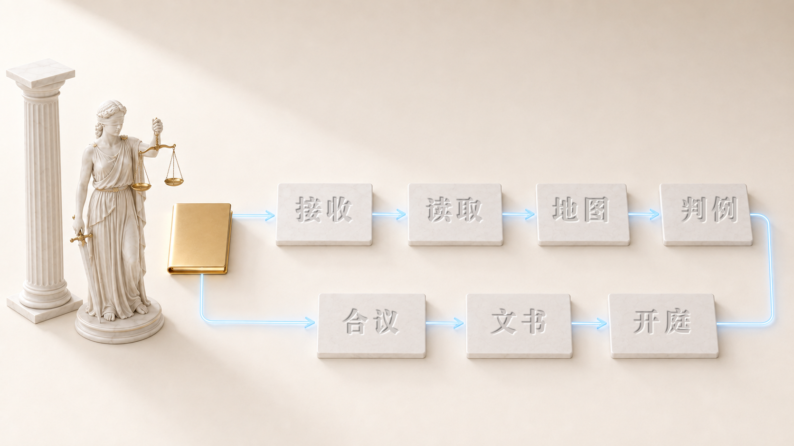

# 忒弥斯详解

[English](DETAILS.md) · [Русский](DETAILS.ru.md) · [简短页面](../README.zh.md)

<p align="center"></p>

这是给想把事情弄明白的人看的长页面。简短版在 [README](../README.zh.md)，
内部构造在[《它是怎么工作的》](HOW-IT-WORKS.en.md)。

## 它做什么

<p align="center"></p>

忒弥斯接手案件里机械的那部分——吃掉整个晚上、又不需要法律判断的那部分。

- **在你自己的电脑上读材料。** PDF、Word、Excel、照片和扫描件。
  识别在本地完成，页面不会跑到别人的云上。
- **搭出案件地图。** 当事人、金额、日期、文件、风险和程序步骤集中在一处，
  每一条都链回它来自的那一页。
- **用程序计算，而不是靠眼睛。** 利息、诉讼费、程序期限、企业证件号的校验位。
- **找对你有利和不利的判例。** 两面分开找，好让你比对方更早看见弱点。
- **起草文书，再交给另一个智能体复核。** 写的那个，不负责通过。

决定权留在律师手里。这是系统的构造，不是页脚的一行小字。

## 一步一步是怎么走的

<p align="center"></p>

七个步骤依次进行：接收、读取、案件地图、判例、五位法学家的合议、文书、开庭。
每一步都在[《它是怎么工作的》](HOW-IT-WORKS.en.md)里拆开讲。

## 快速开始

<p align="center"></p>

```bash
git clone https://github.com/zarubinvibe/themiz.git
cd themiz
bash install.sh

# 然后用你已经在用的工具打开：
claude                   # Claude Code
codex                    # Codex CLI
code .                   # VS Code：智能体在编辑器里打开
python3 cockpit/app.py   # 只要浏览器面板，不用智能体
```

`bash install.sh` 就是全部安装。它把一切装好，并且在装任何东西之前先征求同意；
它完全不需要智能体，一个普通终端就够了。

**Claude Code。** 在该目录运行 `claude`，再说 `/themiz-setup`：
安装会以对话方式进行，一次问一个问题。

**Codex CLI。** 在同一个目录运行 `codex`——同样的智能体和同样的规则已经在项目里了。

**VS Code 或 Cursor。** 用 `code .` 打开目录，在编辑器里启动你的智能体。

**完全不用智能体。** `python3 cockpit/app.py` 会在 `http://127.0.0.1:8800`
打开面板，你可以在那里读案卷、盯期限、手工生成文书。

更新已经装好的副本：`bash scripts/update.sh`。

## 产出是什么

<p align="center"></p>

写好的文书会放进你案件的 `GOTOVO/` 目录，有两种形式：`.md` 用来修改，
`.docx` 用来提交。旁边还留着案件地图、带链接的判例，以及带全部中间数字的计算——
好让你能核对每一个数字，而不是只能相信它。

## 接下来去哪

- [它是怎么工作的](HOW-IT-WORKS.en.md)——内部构造，不带营销。
- [第一步](ONBOARDING.zh.md)——第一天该做什么。
- [安全](../SECURITY.zh.md)——什么留在你这里，什么会离开。
- [如何帮忙](../CONTRIBUTING.zh.md)——如果你想修补或补充。

## 安全与隐私

<p align="center"></p>

案件材料留在你的机器上。离开的只是一个去身份化的判例检索问题——法律规定、
纠纷类别、地区，没有姓名也没有案号。个人数据守卫会检查每一次保存，
不让姓名、地址或证件号码通过。详情见[安全页面](../SECURITY.zh.md)。

## 现状，以及不要期待什么

<p align="center"></p>

系统跑在真实案件上，但它仍在成长，把话说明白更公道：

- 扫描件识别是围绕 Mac 建的。在别的系统上，有些路径不一样。
- 判例在公开来源里检索：那里没有的，系统也找不到。
- 在律师接受之前，任何输出都不是法律意见。
- 目前还没有单独的稳定发布线；修复落在 `main` 上。

## 许可

Themiz Community Licence 1.0：个人律师免费使用，包括个人执业；组织需要商业许可。
文本见 [LICENSE](../LICENSE) 与 [LICENSE.ru.md](../LICENSE.ru.md)。
